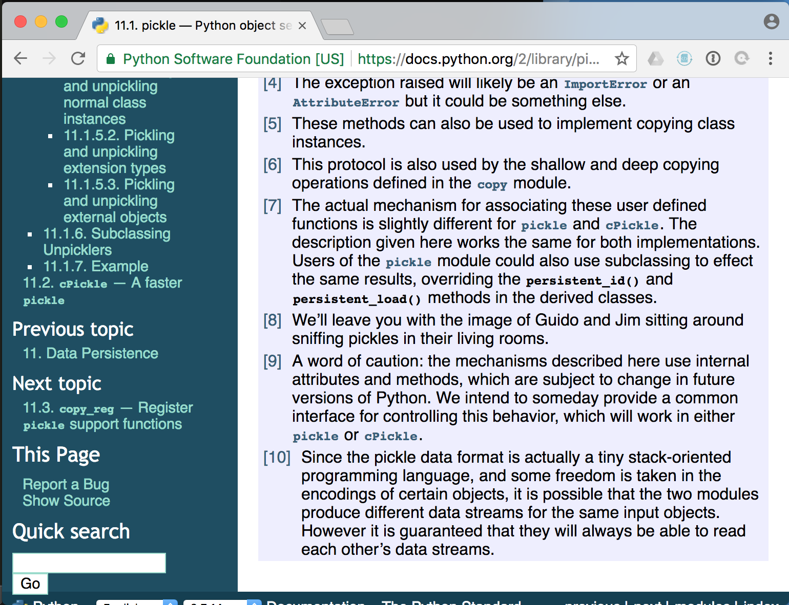
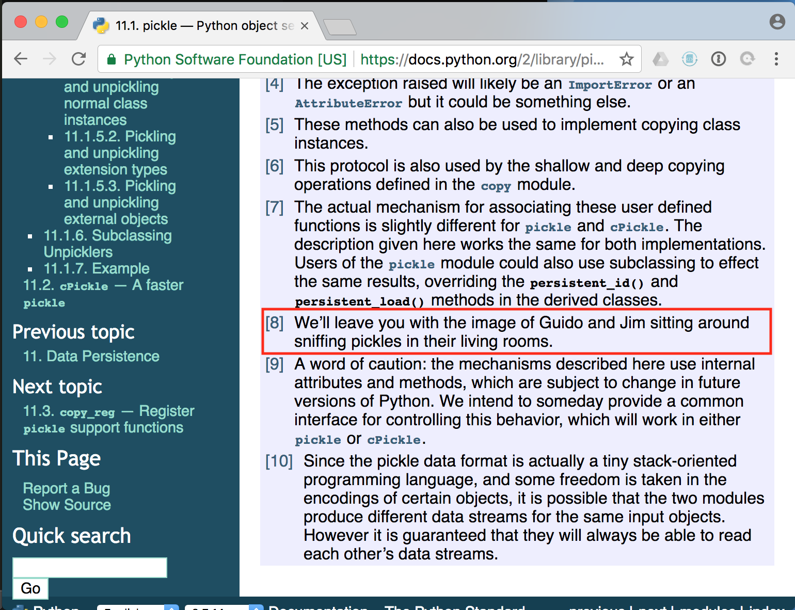
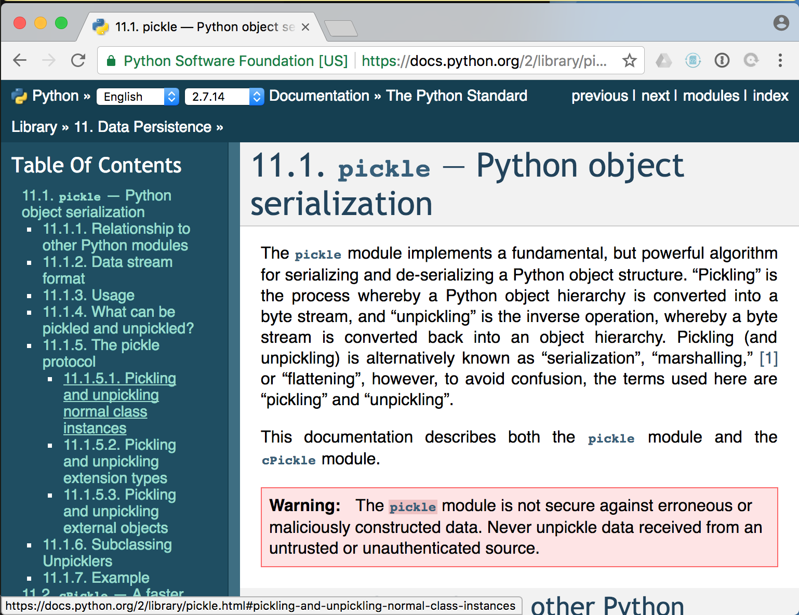
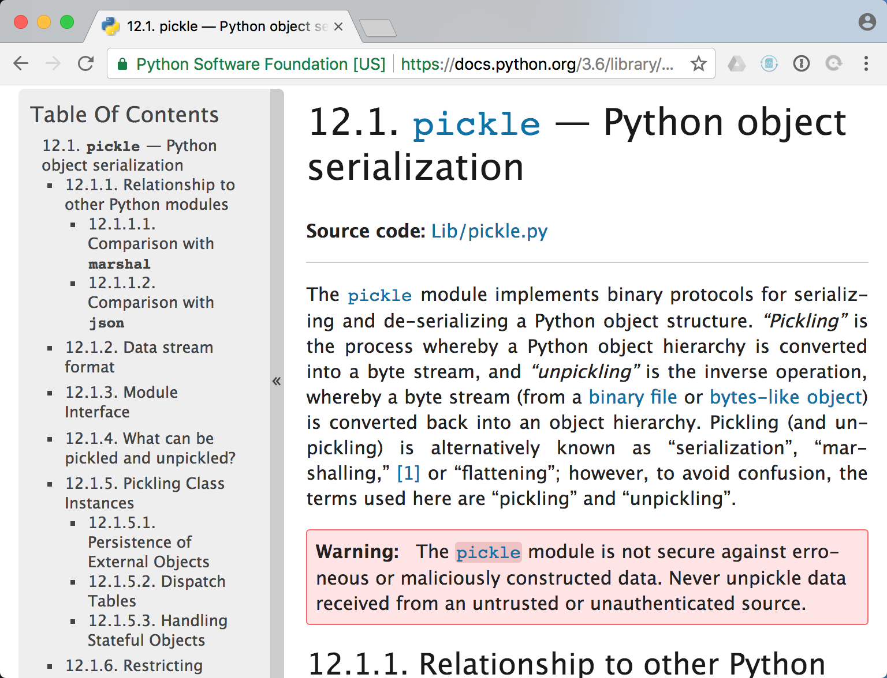

# Pickles Bite

---

.fx: imageslide

<!-- 

## Who am I?

* Software Engineer, Data Scientist, Product Manager, Engineering Manager
* I hate pickles.  I mean, I'm fine with the data type and use them in various
  real world, production cases, but I don't like the cukes in vinegar.  I will
  admit some portion of that bias may have played into my topic selection

-->
---

# What's a pickle to a pythonista?

---

## Quick example

	!python
	import pickle
	qux = [1, None, ('ned', 0)]
	my_object = {'foo': 'bar', 'baz': qux}

	my_pickle = pickle.dumps(my_object)

	print my_pickle

---

## Outputs a special, serialized format in a mini-language

	!python
	(dp0
	S'foo'
	p1
	S'bar'
	p2
	sS'baz'
	p3
	(lp4
	I1
	aNa(S'ned'
	p5
	I0
	tp6
	as.

---

Then, later on another machine or in another session:

	!python
	my_object = pickle.loads(my_pickle)

---

# With great power comes great responsibility.

---

.fx: imageslide

---

.fx: imageslide

<!-- Wait, that's not quite right...-->

---

.fx: imageslide

<!-- That's the right warning, but something's still a bit off...-->

---

.fx: imageslide

<!-- Ahh, there we go, python 3 (it's been out for 9 years... no excuses)...-->

---

# Pickles are fundamentally insecure.

---

.fx: imageslide

<!-- Ahh, there we go, python 3 (it's been out for 9 years... no excuses)...-->

---

## Why pickles are insecure:

* Generating arbitrary objects requires running arbitrary code.  
* This is a feature, not a bug.

<!-- * They contain arbitrary Python objects representing just about anything.
* Generating *anything* requires being willing to execute some code, if necessary (maybe your class' `__init__` method is important...).
* Objects can help the `pickle` module pickle/unpickle them by telling the module exactly how to re-construct the object.
* Unless you made the pickle, you don't know exactly how that feature could be used/abused.
 -->
---

## Pickle bomb in <10 lines

	!python
	import subprocess
	import pickle

	class Dangerous(object):
		def __reduce__(self):
			# This particular payload works on OSX.
			return (
				subprocess.Popen, 
				(('say', 'You are having a very bad day.'),))

	dangerous_pickle = pickle.dumps(Dangerous())

	# Don't do it!
	some_object = pickle.loads(dangerous_pickle)

---

## Do not despair!

Other serialization formats:

* JSON
* CSV
* XML
* YAML

Bonus: they're compatible with other languages and they're human readable.

---

## Maybe despair a little bit!

These formats and their associated deserializers have had a handful of problems over the years.

IANASR, this is not advice, it's an observation:

* Simpler is generally more secure (e.g. JSON represents only float, int, dict, list...)
* Use libraries -- don't set yourself up for injection.
* Will other platforms trust it (e.g. CSV injection)?
* Don't go around trusting user input!

---

## Questions?

* Sources: 
    * The python docs!
    * https://blog.nelhage.com/2011/03/exploiting-pickle/
